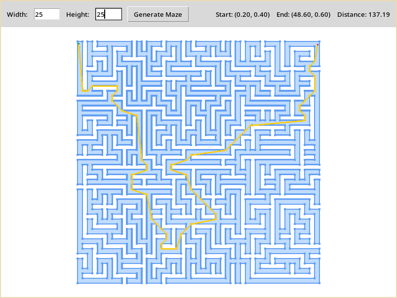

# Maze solver and generator

## Algorithms

### Maze generation

See [generator.py](generator.py).

This program uses the [growing tree algorithm][1] for generating mazes. However,
the algorithm keeps track of a list of edges instead of cells, similar to the
randomized Prim's algorithm.

This creates a 2d NumPy array of boolean with the value of `True` representing
walkable tiles.

### Solving mazes

See [solver.py](solver.py).

The goal is to find the [Euclidean distance optimal][2] path between any points
in the maze. Because I had the luxury of working with mazes with one solution,
I have done some clever optimizations to speed up the search drastically.

The maze is pre-processed with a tile-to-tile search to find which tiles are
part of the resulting path. Otherwise, they are not considered during the main
pathfinding. Because the grid is a non-weighted graph, a simple
[Breadth-first-search][3] is sufficient and can be done in linear time.

Once we have a list of tiles to navigate - which I'll call a "tunnel" - we need
to find the most optimal way to move between them. For this, we can use
[Dynamic programming][4] to iteratively build a taut path between both ends of
the tunnel. 

## Benchmark

- Processor: Intel® Core™ i5-8300H
- Branching factor: 0.25 (use DFS 25% of the time)
- Average of: 100 runs

| Size      | Generation | Solving   |
| --------- | ---------- | --------- |
| 100x100   | 9.56 ms    | 2.06 ms   |
| 500x500   | 318.77 ms  | 49.77 ms  |
| 1000x1000 | 1.55 s     | 232.94 ms |
| 1500x1500 | 3.91 s     | 607.24 ms |
| 2000x2000 | 7.8 s      | 1.16 s    |

## User interface

The UI is built with the [tkinter][5] UI library.

Controls:

| Input  | Action          |
| ------ | --------------- |
| Click  | Place start/end |
| Drag   | Pan             |
| Scroll | Zoom            |



## Usage

### Dependencies

- Python (tested with 3.10)
- NumPy
- Numba
- PIL (pillow fork)

### Quick start

```bash
# Create virtual environment
python -m venv .venv
. .venv/bin/activate

# Install dependencies
pip install numpy numba pillow

# "Warm-up" numba JIT compiled functions
python preview.py

# Run the app
python main.py
```

**Note:** Numba's first-time compilation is slow so do not run the app before
warming it up. It is impossible to render everything in an acceptable framerate
without it as we're using Python (unfortunately).

## Improvements

- Use maze generation algorithm on a random Delaunay triangulation
- Make algorithm work with tree of triangles (still use BFS + DP)
- Switch to a statically typed, compiled programming language and OpenGL

## License

This project is licensed under the [MIT license](LICENSE).

[//]: # (References)
[1]: <https://weblog.jamisbuck.org/2011/1/27/mhze-generation-growing-tree-algorithm>
[2]: <https://en.wikipedia.org/wiki/Any-angle_path_planning>
[3]: <https://en.wikipedia.org/wiki/Breadth-first_search>
[4]: <https://en.wikipedia.org/wiki/Dynamic_programming>
[5]: <https://docs.python.org/library/tkinter.html>
